# Design and Architecture of _Chirp!_

## Domain model

In our domain model, we capture entities and relationships to give a high-level abstraction of the system's static structure, thereby centering the focus on the business logic of our Chirp!-system. We provide a complete diagram below:

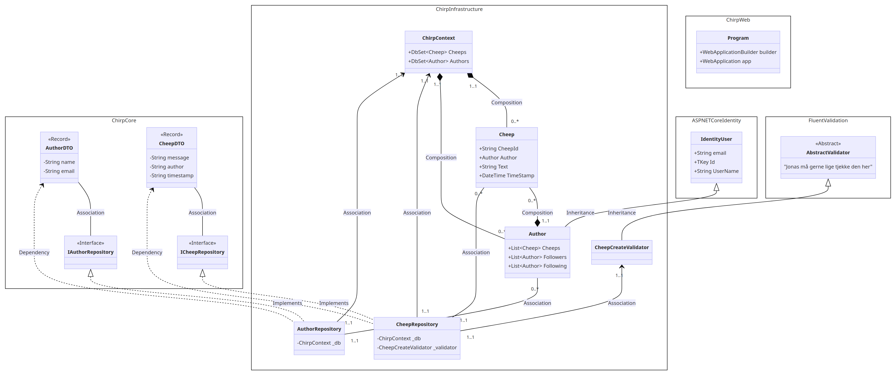

At the highest level in this diagram, we have Chirp.Core, Chirp.Infrastructre and Chirp&#46;Web, wherein certain classes are contained. Apart from this, we have references to external libraries such as AspNetCoreIdentity and FluentValidation.

### Brief Description of Classes inside Chirp.Core

Chirp.Core contains all the core functionality. We have Data Transfer Objects (DTOs) for Cheeps and Authors, as well as interfaces for Author and Cheep Repositories. There is an associative relationship between the DTOs and the repositories since the repositories use the DTOs to create cheeps and authors, get cheeps and name of authors, follow authors etc. The repository interfaces provide an interface contract for the repository implementation, which will transfer structured data between different layers of the application using DTO's as a standardized communication contract in this regard.

### Brief Description of Classes inside Chirp.Infrastructure

Key elements of our infrastructure include CheepRepository and AuthorRepository, which implement the Repository interfaces. These use the ChirpContext class to interact with the database, managing data for authors and cheeps. Each repository handles specific queries related to either authors or cheeps, working with Author and Cheep models. However, they return only Data Transfer Objects (DTOs) to maintain separation of concerns. The Author and Cheep models are queried from the dbsets of the dbcontext. The composition relation between the Author and ChirpContext as well as the Cheep and ChirpContext ensures data integrity, as removing the context also removes the associated data models from the program.

To streamline authentication and authorization, a chirp author inherits from Identity User from ASP.NET Core Identity. There is a composite relationship between Author and Cheep, meaning that an Author can own zero or more cheeps and that any existing cheep is owned by a unique Author.

### Brief Description of Classes inside Chirp&#46;Web

Inside of Chirp&#46;Web, we have our Program.cs, which is our startup class. It has the fields WebApplicationBuilder builder and WebApplication app, which are used for encapsulating the app's services and middleware and for building the web application, setting up authentication and services necessary to make the application run using dependency injection.

## Architecture — In the small

The diagram below depicts the Onion-architecture of our code-base. The different layers and their position shows which code they have access to. 'Chirp.Core' only know about itself, whereas 'Chirp.Infrastucture' has access to the code in 'Chirp.Core' but not the outer layers - except for the database as depicted with the arrow in the diagram. In general, outer layers should depend on inner layers, such that the dependencies flow outwards. The Onion Architecture organises our software in a manner, where we can keep our main business rules separate from external details. This separation of concerns makes the software easier to understand and change. It is also good for testing and adapting to new requirements and technologies. It adheres to SOLID-principles like Dependency Inversion.

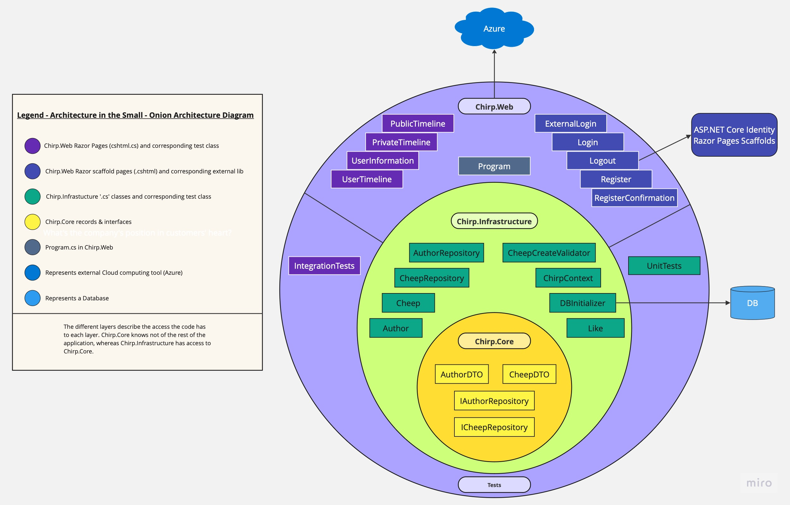

## Architecture of deployed application

We will briefly discuss the architecture of the deployed application, which is based on a client-server-model.

In the deployment diagram, the Web Server, hosted on Azure, manages user requests and serves the website, while the SQL Server, also on Azure, stores structured data like user information and cheeps. The Client browser communicates with the Web Server, which contains the webpage artifact. The Web server, in turn, interacts with the SQL Server, which contains the SQL_Database artifact, for database operations. In this manner, the Client does not directly connect to the SQL Server; but instead communicates with the Web Server, which handles the interaction with the database.

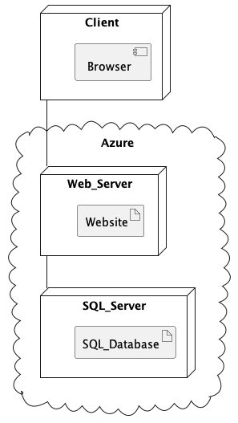

## User activities

We will outline a few different user journeys to showcase the capabilities of Chirp! users. This includes showcasing possible actions for an unauthenticated user, guiding through registration and login processes and demonstrating a typical user journey within the Chirp! app when logged in.

### Unauthenticated User Journey

For an unauthenticated user, typical actions might involve viewing cheeps on the public timeline or accessing specific details about an author, such as past cheeps, total cheeps, and other information, which would be accessible through the author's private timeline.
A user journey corresponding to this use of Chirp is described in the following User Activity diagram:

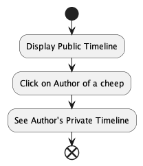

### Registration and Login processes {#login-register}

For the full Chirp! experience, authorised users can personalise their interaction by posting new cheeps, liking already existing cheeps and following authors. [The registration](#registration) and [log-in processes](#login) are described in the following diagrams:

#### Registration {#registration}

Illustration of registering to Chirp:

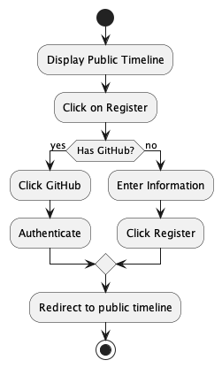

#### Log-in {#login}

Illustration of log-in process:

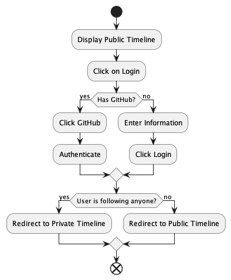

### Cheeping and Following Authors

When using Chirp!, users primarily write cheeps or follow authors and like their cheeps. The upcoming user activity diagrams are centered around these actions. In both diagrams, we assume the user has already been through the [log-in or registration process](#login-register) to engage in these functionalities.

#### Following an Author

Illustration of following other users:

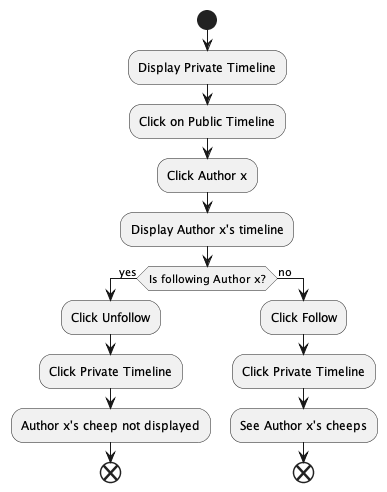

#### Cheeping a Cheep

In this diagram, we assume that we have a user who is already following other users.

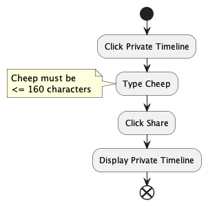

## Sequence of functionality/calls through _Chirp!_

Below we have provided two sequence diagrams to show the dynamic interactions between components in our Chirp! system and the order in which they occur. The first shows a general overview of some of the calls a user - authenticated or not - might go through, while the second gives an idea of what a specific call looks like and the inner workings behind it.

### Sequence diagram 1

In this sequence diagram, we have 3 lifelines: User, Chirp.Web, and ChirpDb. Here we show an overview of the simple sequences both an unauthenticated and authenticated user will go through to access different parts of our application.

### Sequence diagram 2

In this sequence, we have 5 lifelines: UnAuthenticatedUser, Chirp.Web, CheepRepository, ChirpContext and RemoteDB. Here, we see the sequence of calls that is made both internally by the program and externally, from an unauthenticated user, sending a simple GET request to the root endpoint (accessing bdsagroup9chirprazor.azurewebsites.net).

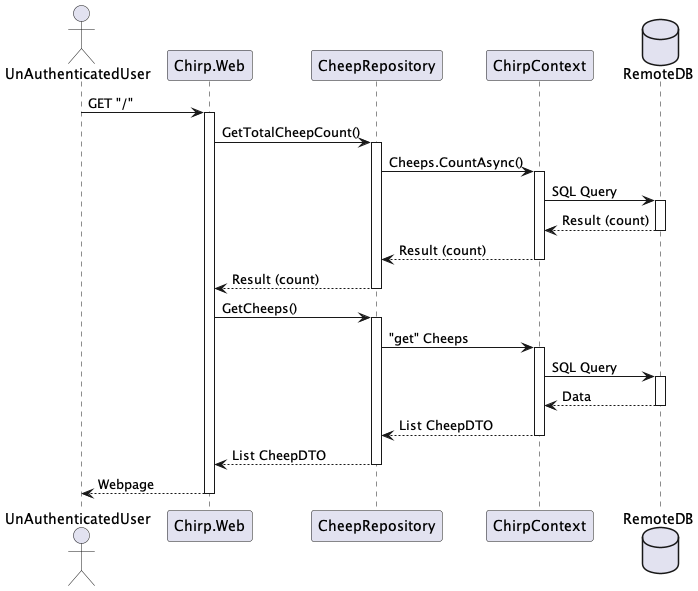

# Process

This chapter gives a brief overview of our process, illustrating GitHub Actions workflows with UML activity diagrams. We highlight the status of our team's project board and offer clear instructions for local setup and testing.

## Build, test, release, and deployment

We use GitHub Workflows to streamline and automate software development processes and to obtain continuous integration and continuous delivery.

The illustration below shows our build and test workflow, which ensures that the code passes all tests before merging a pull request to our main branch.

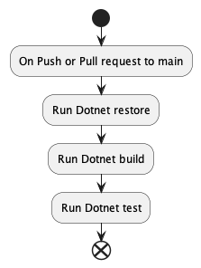

In the illustration below, we see the workflow that creates a release of the program to GitHub. It is triggered when a tag of the format v\* is pushed to GitHub.

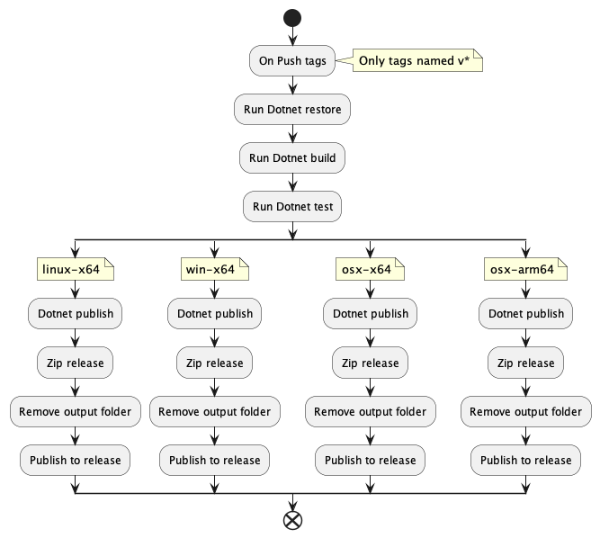

This GitHub workflow is triggered after a push to main, and releases main to our production environment.

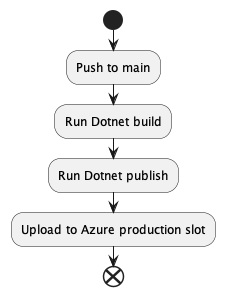

## Teamwork

In this chapter, we will provide an overview of our collaboration by discussing the status of tasks on our project board and showing the general flow of activities from task creation to integration of features.

### Project Board

The image below shows our project board as is before handin of this report. The only issue we have left (issue#194), is making the duplicate UI-elements into partial components as this would rid our application of redundant code.

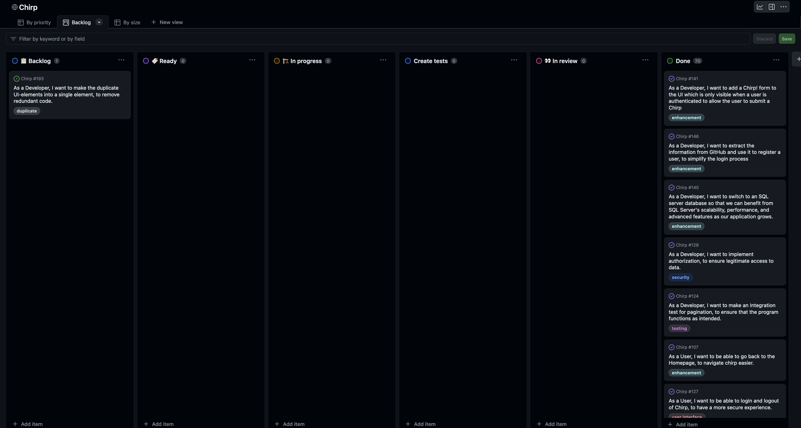

We set up a KanBan board to handle our issues and give us an overview of the process an issue had to go through.

-   The issue is created and put into the 'Backlog'.
-   When the issue is ready with a description, acceptance criteria and has no dependencies pending it is moved to then coloumn 'Ready'.
-   When we start working on the issues it is moved to the 'In progress' column.
-   If the issue relates to the code-base and we hgiave determined it is done, it is moved to 'Create tests'.
-   When tests have been made (if necessary) a PR is created and the issues is moved to the column 'In review'.
-   If the PR for the issues gets approved, it is merged into the main-branch. If this is the case the issue can be closed and moved to the 'Done' column.

## Teamwork diagram

The diagram below shows the entire workflow - from receiving a task to creating an issue and the above-mentioned steps.

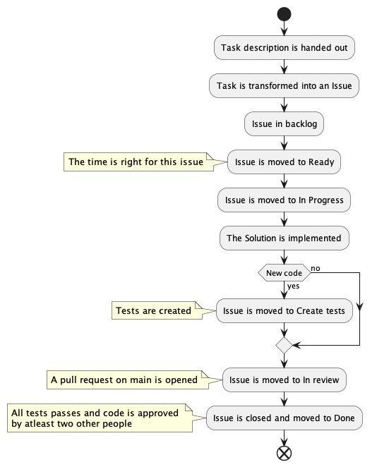

## How to make _Chirp!_ work locally

Firstly, open a command prompt. From here, navigate to the folder in which you want the project to be, and run the command:

`git clone https://github.com/ITU-BDSA23-GROUP9/Chirp.git`

Then, navigate to the Chirp folder with the command:

`cd Chirp`

Then start the application by running the command:

`dotnet run --project src/Chirp.Web`

You see the following in the terminal, click the url http://localhost:5372 or copy it into the adressbar in your browser.

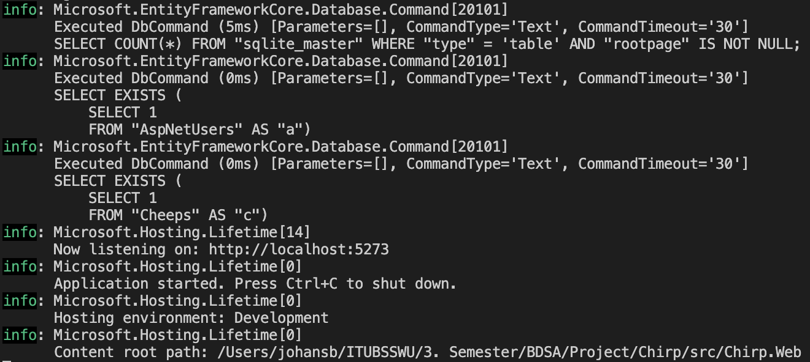

This action should show the application as below:

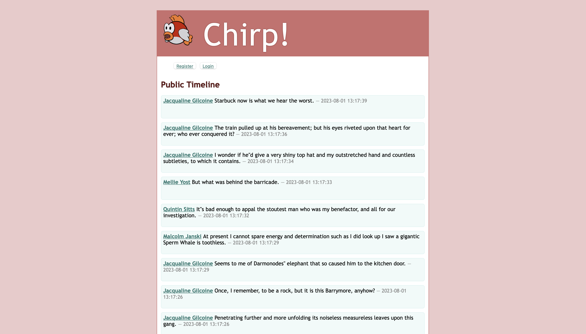

To be able to log in with GitHub, you will need to create a GitHub application. You do this by navigation to this url:

https://github.com/settings/applications/new

Here you need to give it a name and set the homepage-url to localhost:5273.

Set authorisation callback url to localhost:5273/signin-github
client_secrets for the application.

Then click register application.

Then set your environment variables for the following:

`GITHUB_CLIENT_ID=<client_id>`

`GITHUB_CLIENT_SECRET=<client_secret>`

and rerun the application.

## How to run test suite locally

Firstly, open a command prompt. Navigate to the folder in which the Chirp! application is. When standing in the root folder, to run all tests, simply run the command:

`dotnet test`

If you want to run tests for individidual parts of the system, first go to the test directory with the command:

`cd test`

Then go into an individual directory, for example by running:

`cd Chirp.Core.Tests/`

Then run the command:

`dotnet test`

### Our tests

We have made integration tests for the UI-elements in Chirp&#46;Web. Unit tests have been created for all essential methods in the repositories in Chirp.Infrastructure.

# Ethics

In this chapter, we will discuss the software license we have chosen and explain the use of AI/Large Language Models in our development process.

## License

We have chosen the MIT License for our application. Mainly due to its simplicity, which makes it easy for students to collaborate and simplifies licensing issues. In addition, it allows for lots of people to use our webpage, and if we potentially wanted to commercialise Chirp!, the license is really flexible and allows this.

## LLMs, ChatGPT, CoPilot, and others

In this report we have only made use of the LLM's: ChatGPT and CoPilot.

**ChatGPT**: has been used to understand the theory behind some of the features which we have implemented, and generally not to generate code, unless explictly specified as co-writer. In some cases, it has been used for debugging purposes, indicated by including it as a co-writer in commit messages.

**CoPilot**: was only used in the later stages of the process to speed up the code-writing-process when writing generic code. (We decided in the beginning that we would follow Rasmus' reccomendation of writing code without CoPilot, when we were learning the basics of C#.)

### Usefulness and efficiency of LLMs

Large Language models (LLMs) helped us understand concepts and find bugs efficiently. However, we thought that using them directly to generate code for more complex architecture might lead to more extensive debugging and workarounds, which was why we only used it for generating very generic code. It is important to use LLMs in a way where you benefit from their strengths without slowing down the development process.
